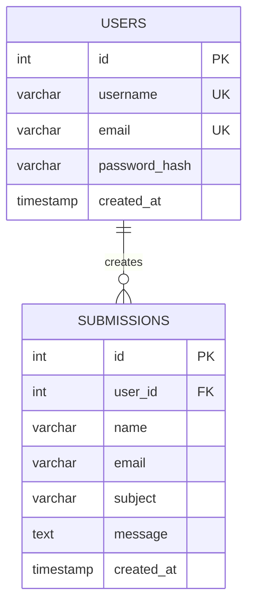

# Signal Desk Technical Documentation

## 1. System overview

Signal Desk is a session-based PHP web application backed by MySQL. It gives authenticated users a private workspace to create and review contact submissions. The application is intentionally small: business logic lives in page controllers, shared security and validation helpers live in `functions.php`, and all database connection setup is isolated in `db.php`.

## 2. Entity-Relationship Diagram



The schema is normalized into two tables. Account identity and credentials belong to `users`; each contact record belongs to exactly one authenticated user through `submissions.user_id`. Unique constraints protect usernames and email addresses. The foreign key uses InnoDB and cascades deletion of a user's associated submissions.

## 3. Architecture and request flow

1. Every page includes `functions.php`, which includes `db.php` and `config.php`.
2. `config.php` starts a session with HttpOnly and SameSite cookie settings.
3. Guest pages call `require_guest()`, while dashboard pages call `require_login()` before rendering protected content.
4. Login looks up a user with a PDO prepared statement, verifies the password with `password_verify()`, regenerates the session ID, and stores only the user ID and display username in the session.
5. Protected pages use `current_user()` to retrieve current account details from MySQL.
6. The contact page validates the submitted values, writes a row with a prepared statement, and redirects or displays a success message.
7. The submissions directory reads records using a database query and escapes every displayed value.
8. Logout clears the session array, expires the session cookie, destroys the PHP session, and redirects to login.

The shared `header.php` and `footer.php` keep navigation and page structure consistent across the application.

## 4. Validation and sanitization

- Username, name, subject, and message values are trimmed and checked with `validate_text()` for minimum and maximum lengths.
- Email values use `filter_var($email, FILTER_VALIDATE_EMAIL)` and are bounded by their database column length.
- Passwords require 8 to 72 characters and must match confirmation during registration.
- All state-changing forms include a random session-backed CSRF token. `verify_csrf()` uses `hash_equals()` before processing POST data.
- SQL values are never concatenated into SQL strings. PDO uses prepared statements with `PDO::ATTR_EMULATE_PREPARES` disabled.
- Passwords are never stored in plain text; `password_hash()` creates the database value.
- `e()` wraps `htmlspecialchars()` with `ENT_QUOTES` and UTF-8 for output encoding.
- Session IDs are regenerated immediately after authentication to reduce session fixation risk.

Client-side HTML attributes such as `required`, `maxlength`, and `type="email"` improve usability, but server-side checks remain authoritative.

## 5. Installation guide

### Prerequisites

Install PHP 8.1 or newer with the PDO MySQL extension, and install MySQL 8 or MariaDB. Confirm that both `php` and `mysql` are available in the terminal.

### Database setup

1. Open `config.php` and set `DB_HOST`, `DB_NAME`, `DB_USER`, and `DB_PASS`.
2. Import the schema and sample rows:

   ```bash
   mysql -u root -p < database.sql
   ```

3. The SQL export creates the database if it does not already exist.

### Run locally

From the project folder:

```bash
php -S localhost:8000
```

Browse to `http://localhost:8000`. The seeded demo account is `demo.user@example.com` with password `password`; change or remove sample credentials before a real deployment.

### Production checklist

- Use a database user limited to this database, not a root account.
- Set `DB_PASS` outside the web root or use environment variables.
- Serve over HTTPS so the secure session-cookie flag is active.
- Replace sample records and rotate any demo credentials.
- Keep PHP and MySQL patched and disable verbose error display in production.

## 6. Deliverable contents

- PHP source files in the project root
- `assets/style.css` for the shared responsive layout
- `database.sql` containing schema and sample data
- `README.md` with a quick-start installation guide
- This documentation file, ready to export as PDF
